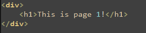
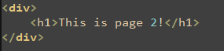
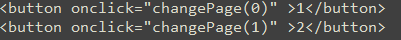
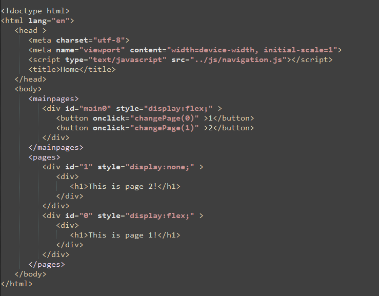

# Pager

Pager is a very lightweight framework that helps you create pages that is displayed on the same document.

## Description

You write your pages in small html bits in the Pager files.    

page1.p  
  
page2.p  
  
masterpage1.mp  
  
When compiled (pc.jar) Pager will insert these pages in your output file. 

output.html  


Pager will also create javascript file (navigation.js) to make it easy to navigate though
the pages. There are two different page types, page (.p), masterpage (.mp). 
You can display one page and one masterpage at the same time.


## Getting Started

### Dependencies

* Java jdk 1.8
* Windows, Linux, Mac

### Installing

[Download](https://github.com/spynetS/Pager/releases/tag/1.0) the two jar files pinit.jar and pc.jar and place them where you want your project


### Executing program

* Initialize the project with pinit.jar
```
java -jar pinit.jar
```
* If you want to create it on a different place then the jar file is located write it
```
java -jar pinit.jar ProjectFolder
```
* Compile project
```
java -jar pc.jar
```
* If you want to customize your folders and files
```
java -jar pc.jar [outputfolder/outputfile]  [inputfolder]
```
## Help


## Authors

Contributors names and contact info

* [spynetsS](https://github.com/spynetS)
  
## Version History

* 0.2
    * Added pages and mainpages
    * Various bug fixes and optimizations
    * See [commit change]() or See [release history]()
* 0.1
    * Initial Release

## License

This project is licensed under the [MIT] License - see the LICENSE.md file for details

## Acknowledgments

